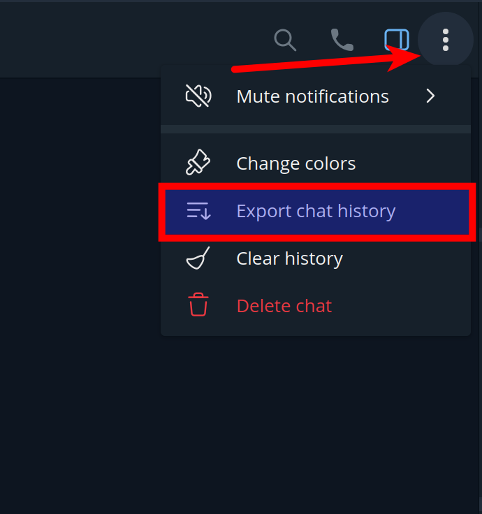
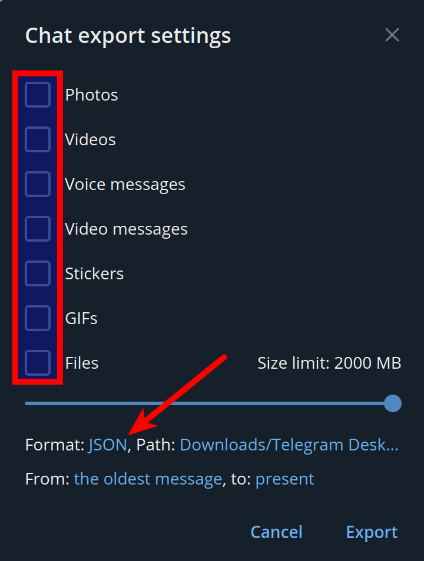

# Simple implementation of Markov Chains with data from Telegram chat history

1. Download Telegram chat history in JSON format

    

    

2. Place the exported chat history (one or many) in `./telegram_dumps` directory

3. Run in Py Shell
```python
from simple_markov_chains import build_simplified_transition_matrix, build_random_sentence

# the value below can be got from a telegram json dump e.g {"messages": [{"from_id": "user71398848", ...}, ...]
from_id = "user71398848"
transition_matrix = build_simplified_transition_matrix(from_id)
build_random_sentence(transition_matrix, sentence_length=10, by_most_common=5)
```
